# Proyecto Storage
Este proyecto es desarrollado como proyecto final de la clase de Desarrollo de Aplicaciones Web. La aplicación desarrollada sirve como aplicación para una idea de negocio por la cual los usuarios pueden guardar cajas en bodegas compartidas por el periodo de tiempo que éstos quieran. Un usuario del sitio pueden crear pedidos, pedir envíos y ver información general respecto a sus cajas guardadas y montos totales mensuales.

## Requerimientos
Este proyecto fue construido en dos partes separadas, el frontend y el backend. El frontend fue desarrollado con Angular 7, mientras que el back con node y express, manejando la base de datos con Mongoose para MongoDB.

Para correr el backend del proyecto, se debe accesar a la carpeta `back/` e instalar los paquetes requeridos con npm:
```bash
npm install
```
posteriormente, ejecutar el backend con:
```bash
node index.js
```

Para correr el frontend, accesar la carpeta `front/` e instalar los paquetes requeridos con npm de la misma manera que con el back, luego correr el front con:
```bash
ng serve
```

De esta manera, se contará con la aplicación ejecutando en el ambiente de desarrollo. El servidor se encontrará en `http://localhost:3000` mientras que el frontend en `http://localhost:4200`.

## Manual de Usuario

### Registro y Login
La navegación de cualquier usuario sin cuenta inicia en la página de resgistro, desde esta página, es necesario poner la información básica de reconocimiento, como nombre, apellido, correo electrónico y contraseña. Una vez escrito todo esto y seleccionada la opción de aceptar Términos y Condiciones, se creará la cuenta y la aplicación lo redirigirá a la página de lista de pedidos.
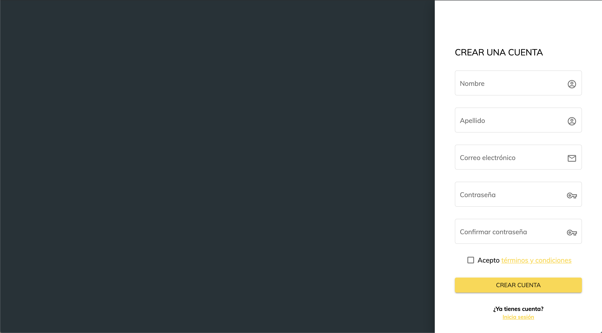

Una vez realizado el registro, el usuario podrá realizar el inicio de sesión con su correo y contraseña desde la página de inicio de sesión:
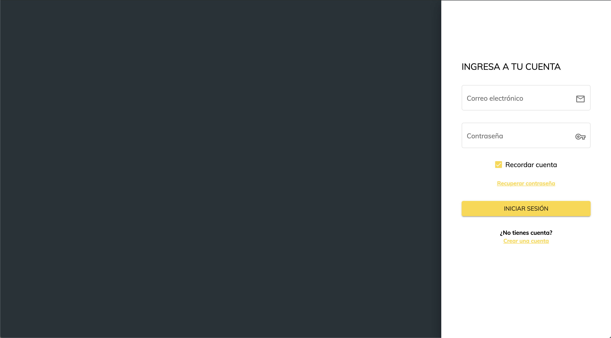

### Lista de pedidos
Dentro de la aplicación, el usuario encontrará una lista con sus pedidos, así como tarjetas de información general en la parte superior de la pantalla que indican cuántos pedidos se tienen activos, cuántas cajas guardadas y cuánto paga al mes por el servicio:
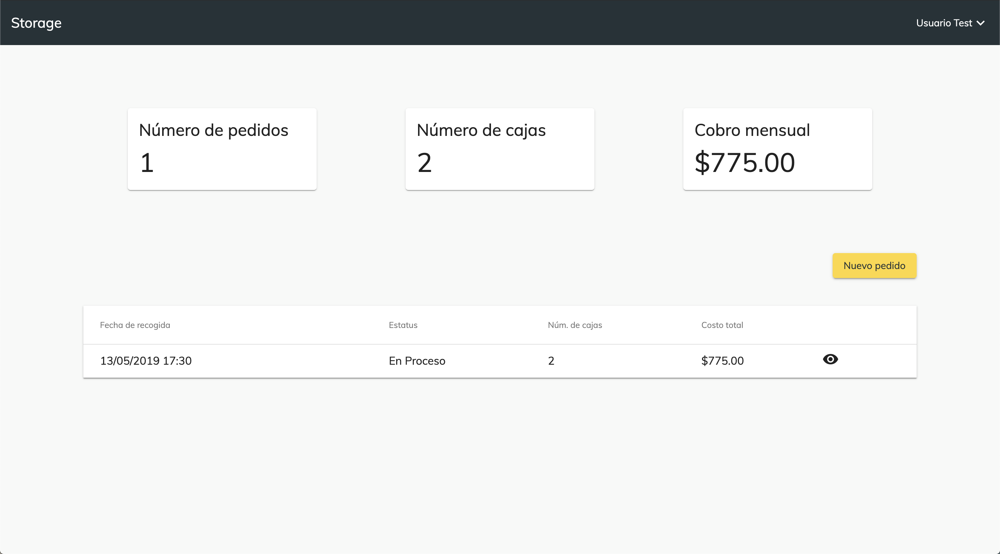

### Nuevo pedido
Dado a que probablemente seas un usuario nuevo, la lista de pedidos se encontrará vacía. ¡Hagamos un pedido! Para esto, da clic en el botón de "Nuevo pedido" en la sección superior derecha de la pantalla, lo cual desplegará ésta pantalla:
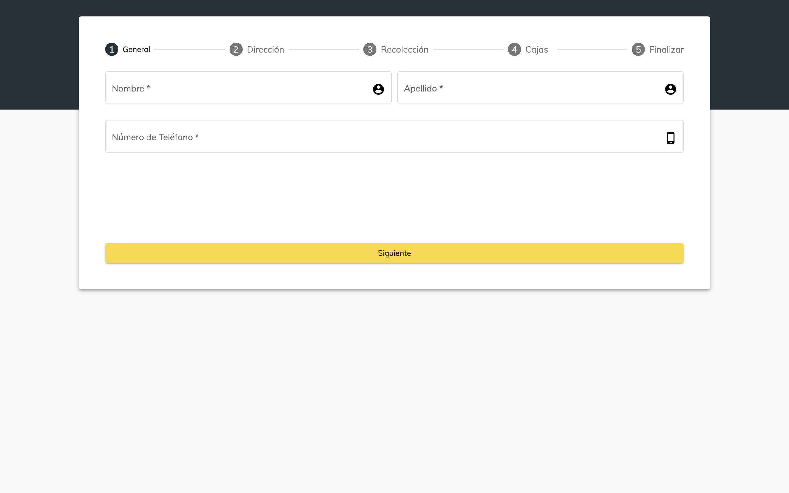

Al llenar los datos de ésta pantalla, se pedirán los próximos. **Recuerda llenar todos los datos de una página para poder continuar a la próxima**. Las pantallas que se desplegarán son las siguientes:
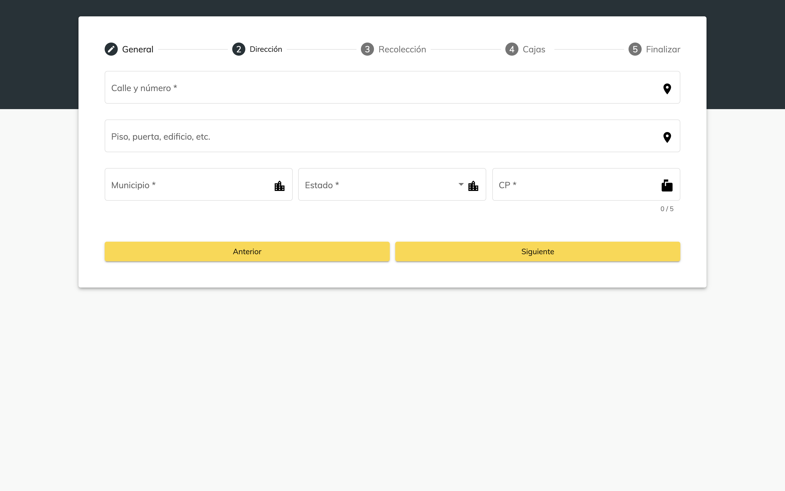
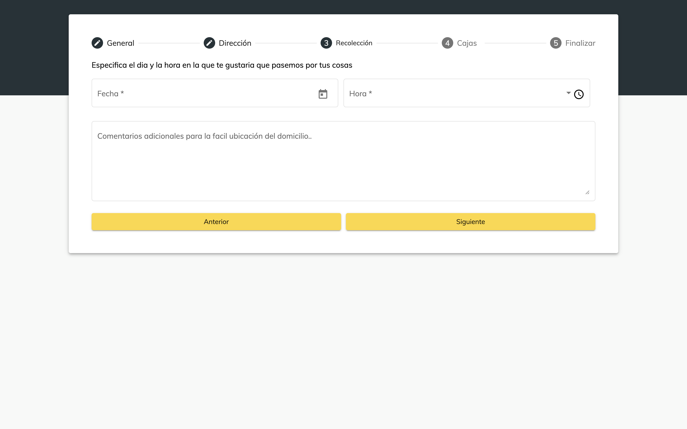

Al llegar a éste punto, notarás que se pide que escribas y agregues cada una de las cajas que se incluirán en el pedido. Para hacer ésto, escribe en la sección pequeña de la izquierda el volumen de la caja en metros cúbicos, y si quieres agrega una descripción de su contenido. Posteriormente, selecciona el ícono de más a la derecha y ¡Listo! se agrega una nueva caja al pedido. Si te llegaras a equivocar, puedes seleccionar el cuadrado a la izquierda de cualquiera de las cajas y hacer clic en el botón de menos que aparecerá.
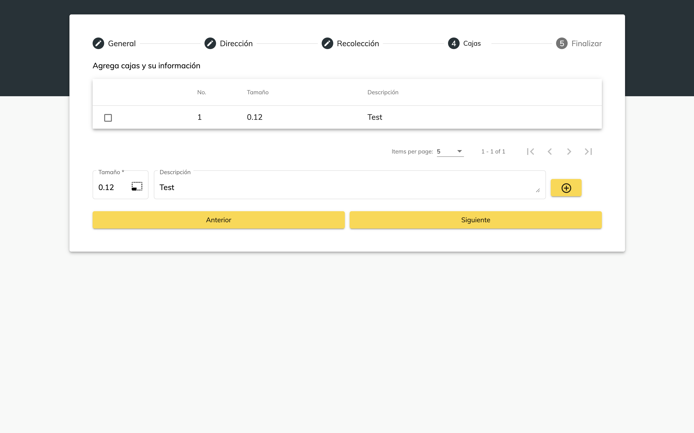
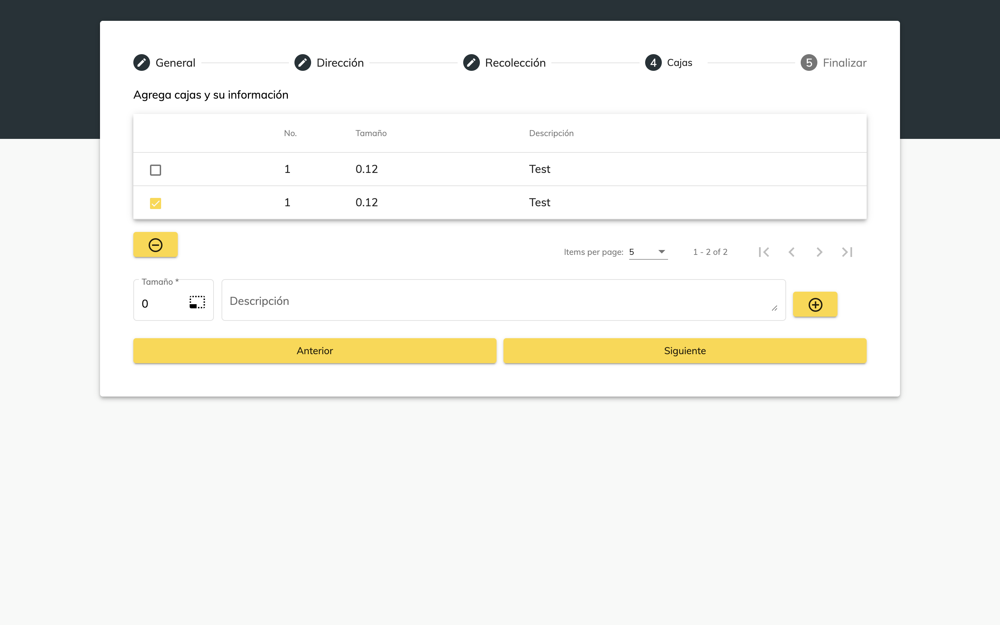
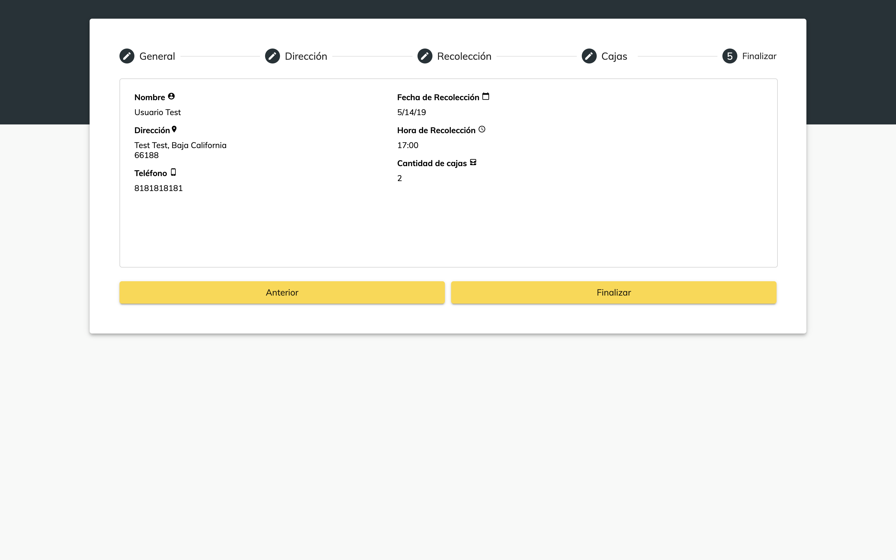

Al terminar el proceso, volverás a la página de lista de pedidos, pero esta vez tendrás tu pedido agregado. Ahora veamos cómo ver el detalle de los pedidos creados.

### Detalle de pedido
Seleccionando el ícono de un ojo en cualquiera de los pedidos que se despliegan, se abrirá la página de detalle de pedido. Ésta página muestra información granular sobre un pedido en particular, y en el caso de los pedidos de los cuales se haya pedido retorno, aparecerá también la información de envío en la sección de Información General. 

De igual manera, en ésta pantalla se puede ver un resumen de cuánto se paga por cada una de las cajas que incluye el pedido, así como el total que se paga.
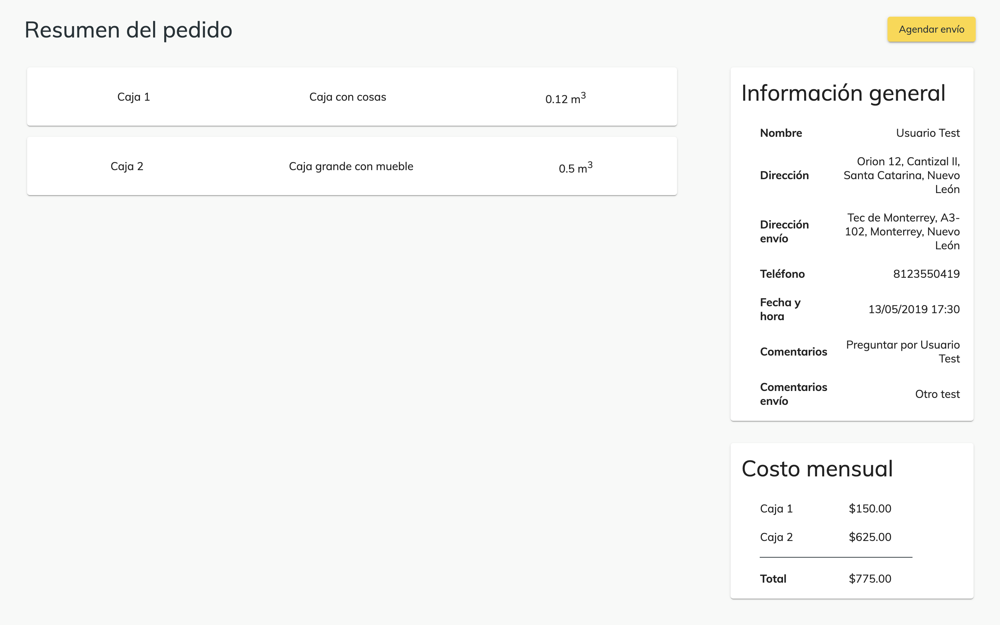

### Agendar envío
En ésta página también se puede seleccionar el botón de "Agendar envío", en el que el usuario podrá agendar el envío de los contenidos del pedido a la dirección de su preferencia. Al seleccionar el botón, se abrirá una página como la que aparece a continuación, en la que se llena la información de envío de la misma manera como se llenó la información de pedido previamente:
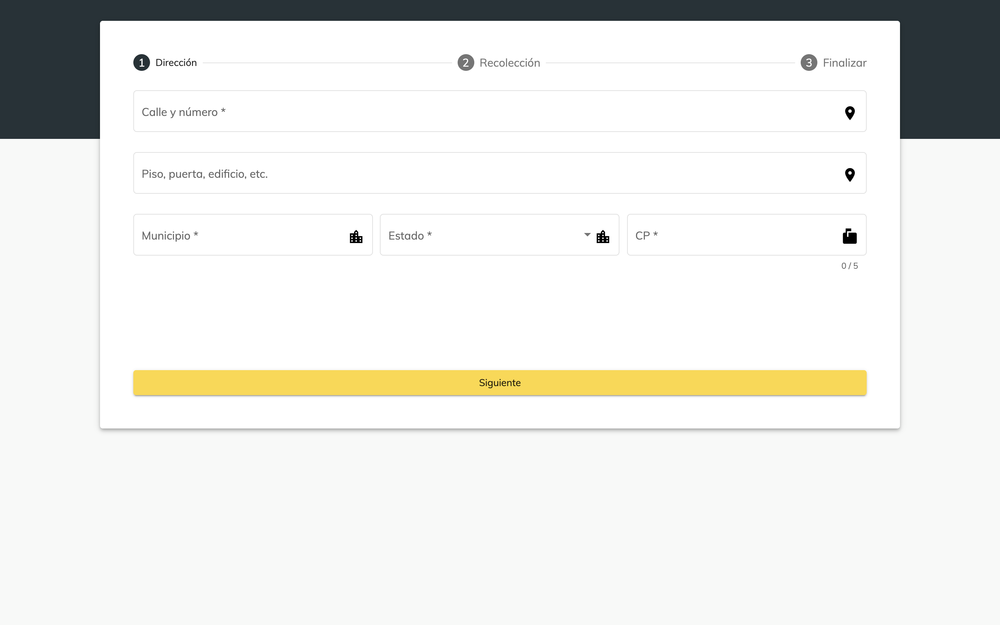

Notarás que para agendar un envío no es necesario seleccionar qué cajas, esto es debido a que **los envíos sólo se aplican a órdenes completas** por lo que no se puede elegir una caja en particular.

Cuando termines el proceso de agendar un envío, volverás a la pantalla de detalle del pedido, pero esta vez se verán campos extras en la sección de "Información General" con los datos de envío.

## Autores
| Autor      | Correo |
|----------------- | --------------- |
|Juan Manuel Pérez | A00819815@itesm.mx |
|Enrique García | A00818997@itesm.mx |
